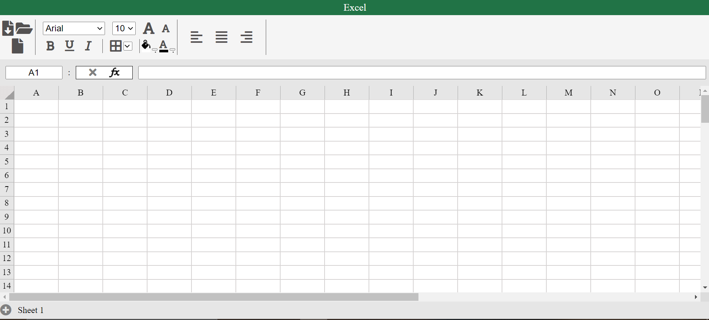

# ExcelClone

## Description:  
This is a clone of Microsoft Excel having some basic functionalities. The UI of the project is made somewhat similar to that of the original excel. It is made for learning purpose. The project is made with pure HTML CSS and JavaScript. 

## Functionalities
1. ### MENU
	a)	Download: To download the spreadsheet in the JSON format.  
	b)	Open: To open a downloaded spreadsheet.
	c)	New: To open a new spreadsheet.  
	d)	Font Decoration: Different font-families can be chosen, font size can either be increased by selecting from input button or directly by font buttons (A), the font can be made bold, italic and underline, the cell can have a full-border or one-sided border with the border option, the cells can be colored with color-fill option, the last color chosen can applied again just by clicking the icon same applied with the text color, the text is by default center aligned but the alignment can be changed with the help of alignment buttons.
	
2. ### Formula
	a)	Address Bar: Display the address of the current chosen cell.  
	b)	Formula Bar: Used to apply formulas to the cell, select the cell you want to apply the formula to then type the formula in the formula-bar using the brackets (to avoid any calculation error in case of big formulas), the corresponding cell would have the result once you pressed the enter. The formula can also be entered from the cell itself by first writing ‘=’ in the cell. The formula comes with a cycle-detection functionality, hence shows error if any cycle is detected in the formula, in that case the cell would retrieve its old entered value to avoid NAN. Inflix evaluation is used to calculate the formula.

3. ### Grid
	a)	The grid only consists of 26 columns and 100 rows by keeping the memory limitation in mind.  
	b)	The grid is purely made from JavaScript and no hard coding has been done on it.   
	c)	The top most and left most row and column remain intact through every scroll in order to make the user at ease and avoid the hassle to scroll up to check the column and row number time to time.   
	d)	The corresponding row and column get highlighted every time a cell is clicked for better user experience.  
	e)	The number column and alphabet row also flash a green color while hovering, a small functionality given by excel.  

4. ### Sheet
	a)	Add: The ‘+’ button is used to add as many sheets to the UI as the user wants.  
	b)	Toggle: Sheets can be toggled once made. The active sheet is displayed by white. 

## Logic Insight
1. ### Formula
	a)	Evaluation:   
		•	The formula needs to have spaces between the addresses and operators hence first we need to add spaces after every alphabet and operator.  
		•	The addresses given in the formula needs to be converted into row and column id.  
		•	The formula then needs to be calculated with the help of inflix-evaluation.  
		•	The cycle detection is done with graph cycle detection algorithm.   
	b)	Children:   
		•	Every time a formula is updated its children and children of children are re-evaluated with the newly set value by, it is achieved by recursion.  
		•	If a value is entered in a cell having a formula, then its value is updated and the formula is erased. Also, the corresponding cell is removed from its children’s  children list.  

2. ### Grid
	a)	The cells can be accessed by their row and column id in the grid.   
	b)	The grid is basically a 3D array having multiple 2D arrays in form of sheets.  
	c)	Each cell have properties that stores the styling, value, formula and children of that cell.   
	d)	When ever any change be done, it is updated in the database  
	
3. ### Sheets
	a)	The sheets are a 2D array where each cell has an array of properties.   
	b)	Every time a new sheet is made, the UI gets cleared and a fresh UI gets appeared.   
	c)	When the user toggle back to the previous sheet, the UI again gets cleared and all the values are retrieved from the database and reflected on the UI which gives a feel of having a new UI for every new sheet.  

